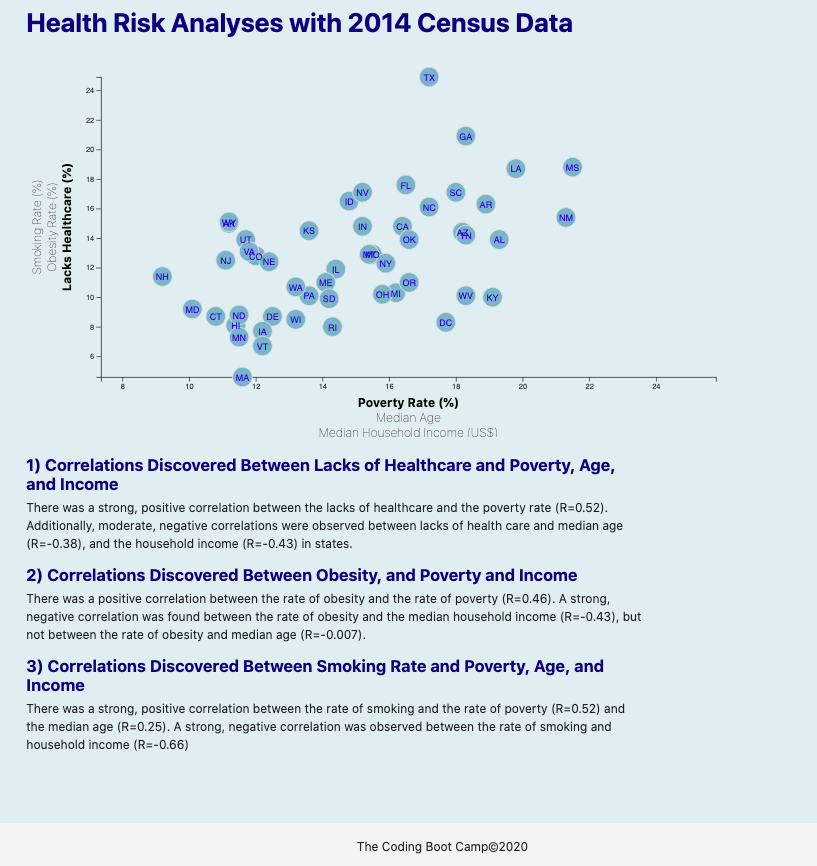
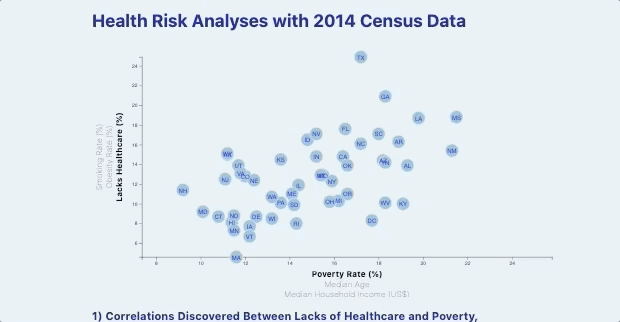
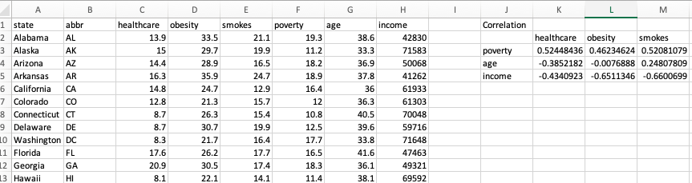

# Data Journalism Project with Census data and D3 graphics

* Using the D3 techniques, I created a scatter plot that represented each state with circle elements. I imported 2014 Census data, `data.csv` by using the `d3.csv` function. I included state abbreviations in the circles with "selectAll.("null")" function, and appended text to the circles. I used the rate of poverty, median income, and median age as x variables, and the rate of lacks healthcare, obesity, and smoking rate as y variables.

** Opening website page

** Animated website page with gif

* I incorporate d3-tip to reveal a specific element's data when the user hovers their cursor over the element. I added tooltips to all circles and displayed each tooltip with the data that the user has selected.

** I also caluculated correlation values for each pair of variables using excel file and wrote a quick conclusion at the bottom of the graph.

Enjoy!
